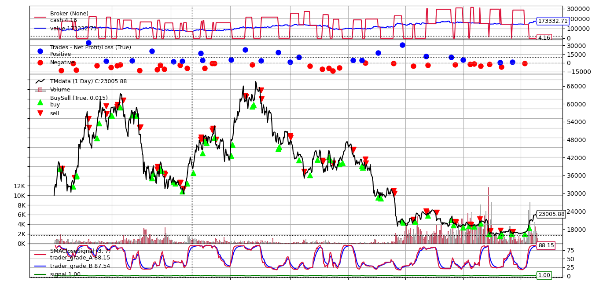

<p align="center">  
   
  <h2 align="center">Token Metrics Data API Examples</h2>  
	<p align="center">
  A comprehensive guidebook to come up with a trading strategy using Token Metrics Grade, backtest the strategy return, and implement it with the trading bot in a real account!
	</p> 
</p>  

<p align="center">          
  <a href="https://developers.tokenmetrics.com/">       
	
  </a>
  <a href="https://www.tokenmetrics.com/">       
    
  </a>
  <a href="https://discord.com/channels/993882885486555146/1066655231791861821">       
    
  </a>
  <a href="https://twitter.com/tokenmetricsinc">       
	
  </a>
</p>



## Table of Content

- [Repo files Structure](#repo-files-structure)
- [Guide Book](#guide-book)
  * [Step1 Collecting data from TM API](#step1-collecting-data-from-tm-api)
  * [Step2 Quantitative Analysis](#step2-quantitative-analysis)
  * [Step3 Backtesting and Analysis](#step3-backtesting-and-analysis)
  * [Step4 Trading Bot](#step4-trading-bot)

## Repo files Structure

```bash
.
├── Data               # Raw and preprocessed data
├── Plots              # Output plots and visualizations
├── README.md          # Main readme documentation
├── Scripts            # Scripts for data preprocessing, analysis, and visualization
├── Step1 Collecting Data.md   # Documentation for step 1
├── Step2 Quantitative Analysis.md   # Documentation for step 2
├── Step3 Backtesting and Analysis.md   # Documentation for step 3
├── Step4 Trading Bot.md   # Documentation for step 4
└── Trading Bot        # Code for trading bot

```

## Guide Book

### Step1 Collecting data from TM API

[Step1 Collecting Data](https://github.com/token-metrics/tm-data-api-examples/blob/master/Step1%20Collecting%20Data.md)

### Step2 Quantitative Analysis

[Step2 Quantitative Analysis](https://github.com/token-metrics/tm-data-api-examples/blob/master/Step2%20Quantitative%20Analysis.md)

### Step3 Backtesting and Analysis

[Step3 Backtesting and Analysis](https://github.com/token-metrics/tm-data-api-examples/blob/master/Step3%20Backtesting%20and%20Analysis.md)

### Step4 Trading Bot

[Step4 Trading Bot](https://github.com/token-metrics/tm-data-api-examples/blob/master/Step4%20Trading%20Bot.md)
