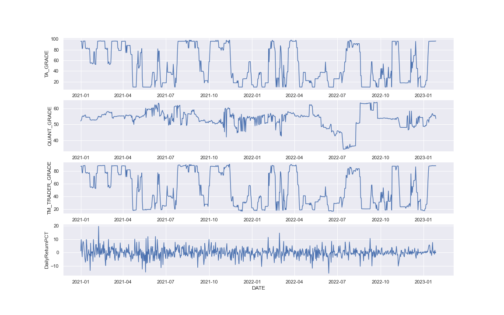
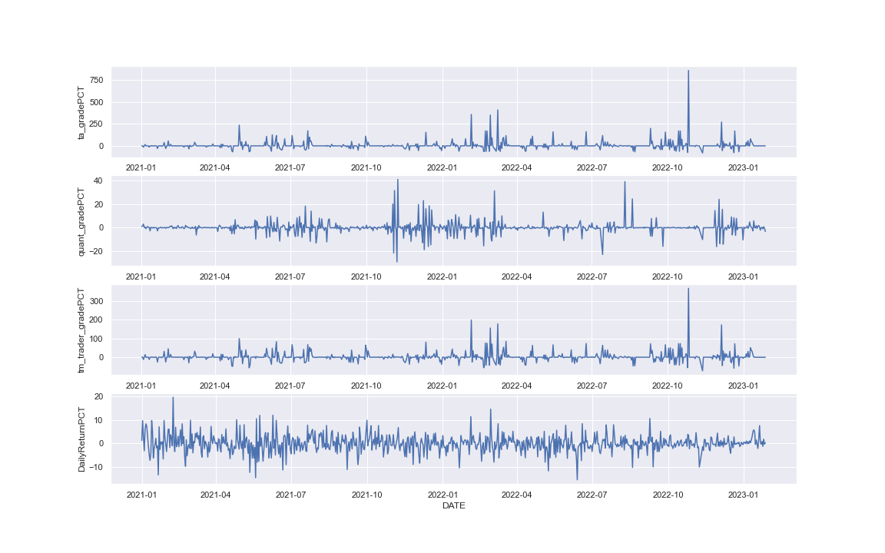
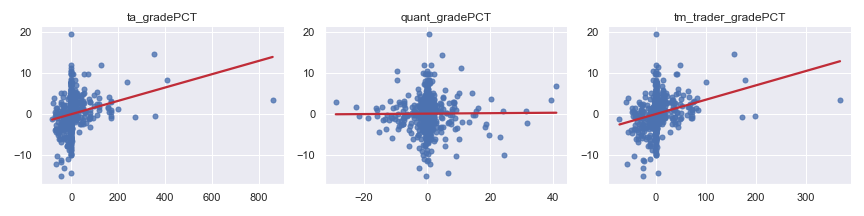

# Step2 Quantitative Analysis

Once we have the data, what we will do next?

Yes, it is time that we need to find our trading idea!

## Table of Content

- [Step2 Quantitative Analysis](#step2-quantitative-analysis)
  * [Preparation before the action](#preparation-before-the-action)
  * [Correlations Analysis](#correlations-analysis)
    + [Fill null data and Save the data for the later](#fill-null-data-and-save-the-data-for-the-later)
  * [Coming up with the trading idea](#coming-up-with-the-trading-idea)
    + [What we have](#what-we-have)
    + [What we will do](#what-we-will-do)
- [Appendix](#appendix)

## Preparation before the action

Here are some packages and functions we will need later:

```python
import matplotlib.pyplot as plt
import seaborn as sns
import numpy as np
import pandas as pd

from typing import Dict, List, Union, Optional, Any

import warnings
warnings.filterwarnings("ignore")

def plot_regressions(X, y, plots_in_col = 3, lowess=False):

    labels = list(X.columns)
    
    N, p = X.shape

    rows = int(np.ceil(p/plots_in_col)) 

    fig, axes = plt.subplots(rows, plots_in_col, figsize=(12, rows*(12/4)))

    for i, ax in enumerate(fig.axes):
        if i < p:
            sns.regplot(X.iloc[:,i], y,  ci=None, y_jitter=0.05, 
                        scatter_kws={'s': 25, 'alpha':.8}, ax=ax, lowess=lowess,
                        line_kws={"color": "#c02c38"})
            ax.set_xlabel('')
            ax.set_ylabel('')
            ax.set_title(labels[i])
        else:
            fig.delaxes(ax)

    sns.despine()
    plt.tight_layout()
    plt.show()
    
    return fig, axes
    
def plot_multiTS(data: pd.DataFrame, cols_idx: List, date_col: str):
    
    sns.set_theme(style="darkgrid")

    # cols_idx = [0, 1,3,4]
    features = (len(cols_idx),1)
    date = date_col
    fig, axes = plt.subplots(features[0], features[1], figsize=(features[0]*4,10))

    # data.date = pd.to_datetime(data.date)
    for i in range(features[0]):
        sns.lineplot(x = date,y = data.columns[cols_idx[i]], data = data,ax = axes[i,])
        
    return fig
```

Then, we will read the data from the previous part.

```python
data = pd.read_csv('../Data/btc_tg.csv', parse_dates=['DATE'])
```

## Correlations Analysis

Before doing that, we should take a look at the relationship between those features.

```python
fig = plot_multiTS(data[['TA_GRADE','QUANT_GRADE','TM_TRADER_GRADE','DailyReturnPCT','DATE']], list(range(4)), 'DATE')
```



From the plot we can conclude some general points:

1. Both the `TM_TRADER_GRADE` and the `TA_GRADE` have similar features.
2. There seems to be a high relationship between the `TA_GRADE` and the `DailyReturnPCT`.  For example, when we were looking at the high volatility part of the `DailyReturnPCT`, it is clear that both `TM_TRADER_GRADE` and `TA_GRADE` were encountering volatility as well.
3. `QUANT_GRADE` contributes little to the `DailyReturnPCT`.

Let's move further, doing some transformation and statistics.

```python
fig = plot_multiTS(data[['ta_gradePCT','quant_gradePCT','tm_trader_gradePCT','DailyReturnPCT','DATE']], list(range(4)), 'DATE')
```



```python
fig,axes = plot_regressions(data[['ta_gradePCT','quant_gradePCT','tm_trader_gradePCT']], data['DailyReturnPCT'], plots_in_col = 3)
```



### Fill null data and Save the data for the later

```python
# Handle missing values
data = data.fillna(method='ffill')

data[['DATE','Open','High','Low','Close','Volume','TA_GRADE','QUANT_GRADE','TM_TRADER_GRADE']].sort_values(by = 'DATE').to_csv('../Data/TMdata.csv', index=False)
```

## Coming up with the trading idea

Apparently, we saw some strong and positive relationships for both `TA_GRADE`, `TM_TRADER_GRADE` with `DailyReturnPCT`. Let me give an example to explain the positive relationship and its trading idea:

### What we have

* `DailyReturnPCT` = The `Close price` of the day - the `Open price` of the day. 

* Our `TM_TRADER_GRADE` will be updated at **starting** of the day.
* There is a significantly positive relationship between the `DailyReturnPCT` and `TM_TRADER_GRADE`.


> **Here is the scenario:**
>
> Now it is the **morning** of `01/27/2023`,  I received today's `TM_TRADER_GRADE` of the `Bitcoin` and it shows a `Bullish` signal. So I bought the `Bitcoin` and had been waiting for the day to end.
>
> When it comes to the **night** of `01/27/2023`,  I sold all my `Bitcoin` position and found I got a 0.1% profit over the day.


### What we will do

Based on the above scenario, let's move it into a more professional description and come up with the following trading logic: 

* Feature: `TM_TRADER_GRADE`
* Trading pair: `BTCUSDT Perpetual`
* Exchange: `Binance US`
* Buy signal: When the `TM_TRADER_GRADE` shows an up-trend
* Sell signal: When the `TM_TRADER_GRADE` shows a down-trend
* Position: `Long`, `Short`
* Commission fee: `0.04%` 
* Size: `All in`
* Starting Cash: `$100000.0`
* Price slippage: `Almost ignorable` (24h Volume (USDT) for `BTCUSDT Perpetual`: `$17B`)
* Frequency: `Daily`
* When entering the market: `00:00:00`
* When out of the market: `23:59:59`

Once we came up with this exciting trading strategy idea, professional backtesting is necessary to verify and measure the strategy.

# Appendix

[Code](https://github.com/token-metrics/tm-data-api-examples/blob/master/Scripts/Step2%20Quantitative%20Analysis.ipynb)
