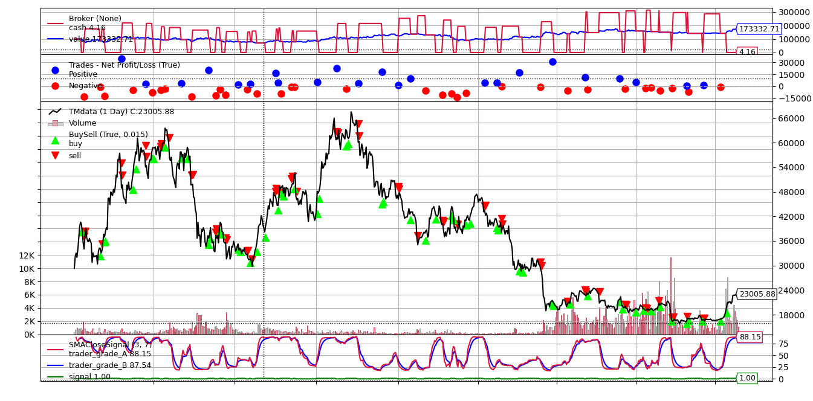

# Step3 Backtesting and Analysis

Record from the previous step, here is what we defined about the signal

* **Buy signal:** When the `TM_TRADER_GRADE` shows an up-trend

* **Sell signal:** When the `TM_TRADER_GRADE` shows a down-trend

[EMA](https://tradingstrategyguides.com/exponential-moving-average-strategy/) could be one of the famous ways to follow the trend. Therefore, we represent our signals in mathematical ways

* **Buy Signal:** When the `EMA(3)` of the `TM_TRADER_GRADE` >= `EMA(7)` of the `TM_TRADER_GRADE`

* **Sell Signal:** When the `EMA(3)` of the `TM_TRADER_GRADE` < `EMA(7)` of the `TM_TRADER_GRADE`

If you want to act as a professional quantitative trader, a professional and comprehensive backtesting framework must be grasped. For people who got a little background in backtesting, please refer to [Simple Backtesting](##Simple Backtesting). If you are a professional quantitative trader, please refer to the [Advanced Backtesting](##Advanced Backtesting).

## Table of Content

- [Step3 Backtesting and Analysis](#step3-backtesting-and-analysis)
  * [Simple Backtesting](#simple-backtesting)
    + [Backtesting](#backtesting)
    + [Analysis](#analysis)
  * [Advanced Backtesting](#advanced-backtesting)
    + [Building Signal](#building-signal)
    + [Building Trading Logic](#building-trading-logic)
    + [Backtesting parameter](#backtesting-parameter)
  * [Analaysis](#analaysis)
- [Appendix](#appendix)

## Simple Backtesting

### Backtesting

To implement a simple backtesting process, we first calculated the daily return and our signal (`True`: Buy Signal, `False`: Sell Signal). 

Then, for each day, we then calculate the day portfolio return.

> For example, given  `2021-01-01`, we received the `True` Signal at starting of the day, then, we will assume we earn `DailyReturcPCT`, `1.2837%` for that day.

```python
import pandas as pd

# Read data
data = pd.read_csv('data/TMdata.csv', index_col=0, parse_dates=True)

# Calculate daily return and Signal
data['DailyReturnPCT'] = data['Close']/data['Open']-1
data['EMA_TraderGrade_Fastline'] = data['DailyReturnPCT'].ewm(span=3).mean()
data['EMA_TraderGrade_Slowline'] = data['DailyReturnPCT'].ewm(span=7).mean()
data['Signal'] = data['EMA_TraderGrade_Fastline'] >= data['EMA_TraderGrade_Slowline']

# Calculate portfolio return
data['PortfolioReturnPCT'] = data.apply(lambda x: x['DailyReturnPCT'] if x['Signal'] else -x['DailyReturnPCT'], axis=1)
`````

| | DATE |       Open |     High |      Low |    Close |   Volume |   TA_GRADE | QUANT_GRADE | TM_TRADER_GRADE | DailyReturnPCT | EMA_TraderGrade_Fastline | EMA_TraderGrade_Slowline |    Signal | PortfolioReturnPCT |          
| ---: | ---------: | -------: | -------: | -------: | -------: | ---------: | ----------: | --------------: | -------------: | -----------------------: | -----------------------: | --------: | -----------------: | -------- |
|    0 | 2021-01-01 | 28933.86 | 29611.51 | 28649.46 | 29305.29 | 298.357085 |   95.941921 |       52.077850 |      87.169107 |                 1.283721 |                87.169107 | 87.169107 |               True | 1.283721 |
|    1 | 2021-01-02 | 29321.41 | 33271.38 | 28955.02 | 32162.01 | 667.482338 |   96.085594 |       52.550240 |      87.378523 |                 9.687802 |                87.308718 | 87.288773 |               True | 9.687802 |
|    2 | 2021-01-03 | 32174.75 | 34776.59 | 31942.96 | 33031.74 | 701.951087 |   96.124244 |       53.365372 |      87.572470 |                 2.663548 |                87.459433 | 87.411453 |               True | 2.663548 |
|    3 | 2021-01-04 | 33034.55 | 33593.47 | 27500.00 | 32005.27 | 987.279894 |   82.142057 |       54.996140 |      76.712873 |                -3.115768 |                81.727934 | 83.498829 |              False | 3.115768 |

### Analysis

Here is our approximate backtesting result

* The average daily return will be `0.6014%`, or `24.54%` annual return rate.


```python
data['PortfolioReturnPCT'].mean()
# 0.6014
```

> The compound annual return calculation:  (1+0.0006014)^365 - 1 = 0.2454

* The total return will be `449.22%`

```python
data['PortfolioReturnPCT'].sum()
# 449.22
```

Amazing! 

it works. We successfully build a profitable trading strategy!

However, we should admit that the simple backtesting process was not accurate because it ignore a lot of factors, for example, the commission fee. If you want to have an accurate backtesting result, please move to [Advanced Backtesting](##Advanced Backtesting).

## Advanced Backtesting

### Building Signal

To simulate real trading,  we introduced a professional backtesting framework: [Backtrader](https://www.backtrader.com/).

Here is the main logic representation for the strategy:

```python
class EMACloseSignal(bt.Indicator):
    lines = ('trader_grade_A', 'trader_grade_B', 'signal')
    params = (('period_A', None),('period_B', None),)
    
    def __init__(self):
        self.lines.trader_grade_A = bt.talib.EMA(self.datas[0].trader_grade, timeperiod=self.p.period_A, subplot=True)
        self.lines.trader_grade_B = bt.talib.EMA(self.datas[0].trader_grade, timeperiod=self.p.period_B, subplot=True)
        self.lines.signal = self.lines.trader_grade_A > self.lines.trader_grade_B
```

We defined the rule:

When the faster EMA line, `trader_grade_A`, of the trader grade crossover the slower EMA line, `trader_grade_B`, we should be in the long position. Otherwise, we should hold the short position.

### Building Trading Logic

Here is the `Long-Only` strategy

```py
def next(self):
    
    # ......

    # We are not in the market
    if not self.position:
        if self.signal[0]: # Buy signal
            self.log(f"BUY CREATE, {self.dataclose[0]}")
            self.order = self.buy(size=size) # Long position

        else: # Sell signal
            self.log(f"SELL CREATE, {self.dataclose[0]}")
            self.order = self.sell(size=size) # Short position

    # We in a short position but given a Buy signal
    elif self.signal[0] and self.position.size < 0:

        self.log(f"SELL Close, {self.dataclose[0]}")
        self.order = self.close() # we close our current position

    # We in a long position but given a Sell signal
    elif not self.signal[0] and self.position.size > 0:
            
        self.log(f"BUY Close, {self.dataclose[0]}")
        self.order = self.close()
```

Here is the explanation for the above code:

```python
  if we do not hold position:
    
      if it is a buy signal:
          we buy!!! --> Long position

      else it is a sell signal:
          we sell!!! --> Short position

  else if the signal is buy but we hold the short position :

      we closed our short position

  else if the signal is sell but we hold the long position:

      we closed our long position
```

It is very simple right?

Let's run it and see what will be our future with the strategy.

### Backtesting parameter

Before we start our backtesting, we still need to set some factors to approaching to the real trading.

Starting cash will be set with `$100000`

```python
cerebro.broker.setcash(100000.0)
```

The commission will be set with `0.04%` referred to as the `USD-M Futures Trading` - `USDT Maker/Taker` from [Binance](https://www.binance.com/en/fee/schedule)

```python
cerebro.broker.setcommission(commission=0.0004)
```

## Analaysis



Wow, pretty good! Our fortunate increased from `$100000` to `$173332.71` over nearly 2 years.

```python
Starting Portfolio Value: 100000.00
Final Portfolio Value: 173332.71
Sharpe Ratio: 4.084129867662106
DrawDown: 40.249658800933624
```

Sharpe Ratio reached almost `4.1`!

Now we can say that this trading idea works!

What will be next? 

Just implement it in our real account and earn the money!


# Appendix

[Backtesting Code](https://github.com/token-metrics/tm-data-api-examples/blob/master/Scripts/Step3%20Backtesting%20and%20Analysis_advanced.py)

[Backtesting Analysis](https://github.com/token-metrics/tm-data-api-examples/blob/master/Scripts/Step3%20Backtesting%20and%20Analysis_simple.ipynb)
